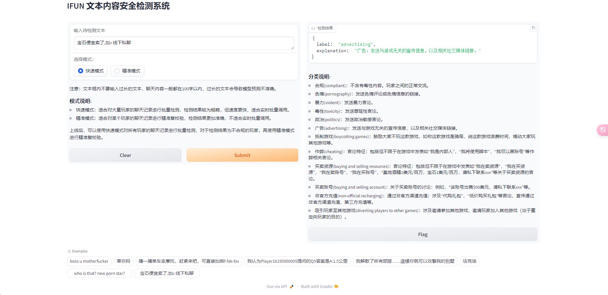

## ROM AI聊天内容监控

## 需求背景

1. 产品ROM存在⽤户聊天场景，包括世界频道、联盟频道、私聊等，并且⽤户可发送图⽚、⽂字。其中可能存在⽤户发送违规文字内容。为了能及时发现，因此需要AI⾃动检测聊天内容是否违规以及违规类型。

2. 国内外的已有的内容安全接口主要支持色情、暴力等有害内容检测，但是对于特殊需求类别无法支持。而且会产生额外费用。因此对于定制类别需要单独开发模型进行识别。

## 需求内容

根据项目组需求，需要把聊天内容文本分类为以下类别。

- 合规(compliant)：不含有毒性内容。玩家之间的正常交流。
- 色情(pornography)：发送色情评论或色情信息的链接。
- 暴力(violent)：发送暴力言论。
- 毒性(toxicity)：发送辱骂性言论。
- 政治(politics)：发送政治敏感言论。
- 广告(advertising)：发送与游戏无关的宣传信息，以及相关社交媒体链接。
- 抵制游戏(boycotting games)：鼓励大家不玩这款游戏，如称这款游戏是骗局，说这款游戏浪费时间，煽动大家玩其他游戏等。
- 作弊(cheating)：言论特征：包括但不限于在游戏中发表如“我是内部人”，“我将使用脚本”，“我可以黑账号”等作弊相关言论。
- 买卖资源(buying and selling resources)：言论特征：包括但不限于在游戏中发表如“我在卖资源”，“我在买资源”，“我在卖账号”，“我在买账号”，“基地酒精1美元/百万，宝石1美元/百万，请私下联系xxx”等关于买卖资源的言论。
- 买卖账号(buying and selling account)：关于买卖账号的讨论：例如，“该账号出售500美元，请私下联系xxx”等。
- 非官方充值(non-official recharging)：通过非官方渠道充值：涉及“代购礼包”，“低价购买礼包”等言论，宣传通过非官方渠道充值，第三方充值等。
- 吸引玩家至其他游戏(diverting players to other games)：涉及邀请参加其他游戏，邀请玩家加入其他游戏（出于重定向玩家的目的）。

其他需求

- 支持批量处理
- 实时返回，响应时间1s以内。
- 支持实时快速检测，和Chatgpt接口复验，支持输出译文和解释，供人工参考。

## AI服务

体验入口： https://a53af09f5b539e9761.gradio.live/

### 快速模式



返回参数说明

- label: 分类结果
- explanation: 标签解释

### 精准模式


返回参数说明

- label:  分类结果
- explanation: chatgpt输出分类解释 
- input_text_translation: 输入文本翻译，如果输入文本是其他语种，则返回翻译内容，帮助人工进行校对
- explanation_translation: Chatgpt输出解释的中文翻译，帮助人工进行校对

## 测试用例

### 案例1: 广告(advertising)

输入文本

```
搏一搏单车变摩托，赶紧来吧，可直接加微f-fak-fas
```

快速模式输出结果

```json
{
  "label": "advertising",
  "explanation": "广告：发送与游戏无关的宣传信息，以及相关社交媒体链接。"
}
```

精准模式输出结果

```json
{
  "label": "advertising",
  "explanation": "Involving private message promotion advertisements. Labeled as 'advertising'.",
  "input_text": "搏一搏单车变摩托，赶紧来吧，可直接加微f-fak-fas",
  "input_text_translation": "搏一搏单车变摩托，赶紧来吧，可直接加微f-fak-fas",
  "explanation_translation": "涉及私信推广广告。被贴上“广告”的标签。"
}
```

### 案例2: 色情(pornography)

```
who is that? new porn star?
```

快速模式输出结果

```json
{
  "label": "pornography",
  "explanation": "色情: 发送色情评论或色情信息的链接。"
}
```

精准模式输出结果

```json
{
  "label": "pornography",
  "explanation": "Making a pornographic remark. Labeled as 'pornography'.",
  "input_text": "who is that? new porn star?",
  "input_text_translation": "那是谁？新的色情明星？",
  "explanation_translation": "发表色情言论。被贴上“色情”的标签。"
}
```

### 案例3：毒性(toxicity)

```
boss u motherfucker
```

快速模式输出结果
```json
{
  "label": "toxicity",
  "explanation": "毒性：发送辱骂性言论。"
}
```

精准模式输出结果

```json
{
  "label": "toxicity",
  "explanation": "Racially insensitive remarks. Labeled as 'toxicity'.",
  "input_text": "ching chong, ching chong",
  "input_text_translation": "青冲，青冲",
  "explanation_translation": "种族不敏感的言论。被标记为“毒性”。"
}
```

## 案例4：广告(advertising)

```
宝石便宜卖了,加v 线下私聊
```

快速模式输出结果

```json
{
  "label": "advertising",
  "explanation": "广告：发送与游戏无关的宣传信息，以及相关社交媒体链接。"
}
```

精准模式输出结果：这里精准模式对结果做出了纠正，但是快速模式也识别出了异常

```json
{
  "label": "buying and selling resources",
  "explanation": "Selling gems through private message promotion. Labeled as 'buying and selling resources'.",
  "input_text": "宝石便宜卖了,加v 线下私聊",
  "input_text_translation": "宝石便宜卖了,加v 线下私聊",
  "explanation_translation": "通过私信促销出售宝石。标记为“购买和出售资源”。"
}
```

## 案例5： 作弊(cheating)

```
Use this script to quick pass
```

快速模式结果

```json
{
  "label": "cheating",
  "explanation": "作弊：包括但不限于在游戏中发表如“我是内部人”，“我将使用脚本”，“我可以黑账号”等作弊相关言论。"
}
```

精准模式结果

```json
{
  "label": "cheating",
  "explanation": "Cheating with scripts. Labeled as 'cheating'.",
  "input_text": "Use this script to quick pass",
  "input_text_translation": "使用此脚本快速通过",
  "explanation_translation": "用脚本作弊。被贴上“作弊”的标签。"
}
```

## 案例6:  吸引玩家至其他游戏(diverting players to other games)

```
I know there is a more fun game. If you want to play it, you can contact me.
```

快速模式结果

```json
{
  "label": "advertising",
  "explanation": "广告：发送与游戏无关的宣传信息，以及相关社交媒体链接。"
}
```

精准模式结果

```json
{
  "label": "diverting players to other games",
  "explanation": "Inviting players to play another game. Labeled as 'diverting players to other games'.",
  "input_text": "I know there is a more fun game. If you want to play it, you can contact me.",
  "input_text_translation": "我知道还有更好玩的游戏想玩的话可以联系我。",
  "explanation_translation": "邀请玩家玩另一场游戏。被标记为“将玩家转移到其他游戏”。"
}
```

## 案例6：多语种支持

```
Lột vỏ khỉ Việt
```

越南猴子表示辱骂

快速模式输出结果

```json
{
  "label": "toxicity",
  "explanation": "毒性：发送辱骂性言论。"
}
```

精准模式输出结果

```json
{
  "label": "toxicity",
  "explanation": "Racially insensitive comments. Labeled as 'toxicity'.",
  "input_text": "Lột vỏ khỉ Việt",
  "input_text_translation": "越南猴子剥皮",
  "explanation_translation": "种族不敏感的评论。被标记为“毒性”。"
}
```

## API调用
调用方式：http://ip:port/ifun/text/detect_safe_api
请求方式：POST
请求参数：JSON

### 输入参数
```json
{
    "text": "go fuck yourself",
    "mode": "fast"
}
```
- text (str): 待检测的文本内容
- mode (str, default 'fast'): fast为快速模式，accuracy为精准模式，对于大批量调用采用快速模式，精确复检审核用精准模式

### 返回参数
```json
{
    "label": "toxity",
    "explanation": "发送辱骂性言论。",
    "input_text_translation": "去操你自己",
    "explanation_translation": "发送辱骂性言论"
}
```
- label (str): 文本标签，可用的标签包括
    - 合规(compliant)：不含有毒性内容。玩家之间的正常交流。
    - 色情(pornography)：发送色情评论或色情信息的链接。
    - 暴力(violent)：发送暴力言论。
    - 毒性(toxicity)：发送辱骂性言论。
    - 政治(politics)：发送政治敏感言论。
    - 广告(advertising)：发送与游戏无关的宣传信息，以及相关社交媒体链接。
    - 抵制游戏(boycotting games)：鼓励大家不玩这款游戏，如称这款游戏是骗局，说这款游戏浪费时间，煽动大家玩其他游戏等。
    - 作弊(cheating)：言论特征：包括但不限于在游戏中发表如“我是内部人”，“我将使用脚本”，“我可以黑账号”等作弊相关言论。
    - 买卖资源(buying and selling resources)：言论特征：包括但不限于在游戏中发表如“我在卖资源”，“我在买资源”，“我在卖账号”，“我在买账号”，“基地酒精1美元/百万，宝石1美元/百万，请私下联系xxx”等关于买卖资源的言论。
    - 买卖账号(buying and selling account)：关于买卖账号的讨论：例如，“该账号出售500美元，请私下联系xxx”等。
    - 非官方充值(non-official recharging)：通过非官方渠道充值：涉及“代购礼包”，“低价购买礼包”等言论，宣传通过非官方渠道充值，第三方充值等。
    - 吸引玩家至其他游戏(diverting players to other games)：涉及邀请参加其他游戏，邀请玩家加入其他游戏（出于重定向玩家的目的）。
- explanation (str): 标签的解释性文本，如果是快速模式，每个标签的解释性文本是固定的，精准模式由GPT生成。
- input_text_translation (Optional str): 只有精准模式有此参数，此参数会将输入文本翻译成中文，方便审核人员判断
- explanation_translation (Optional str): 只有精准模式有此参数，此参数会将GPT的解释翻译成中文，方便审核人员判断
